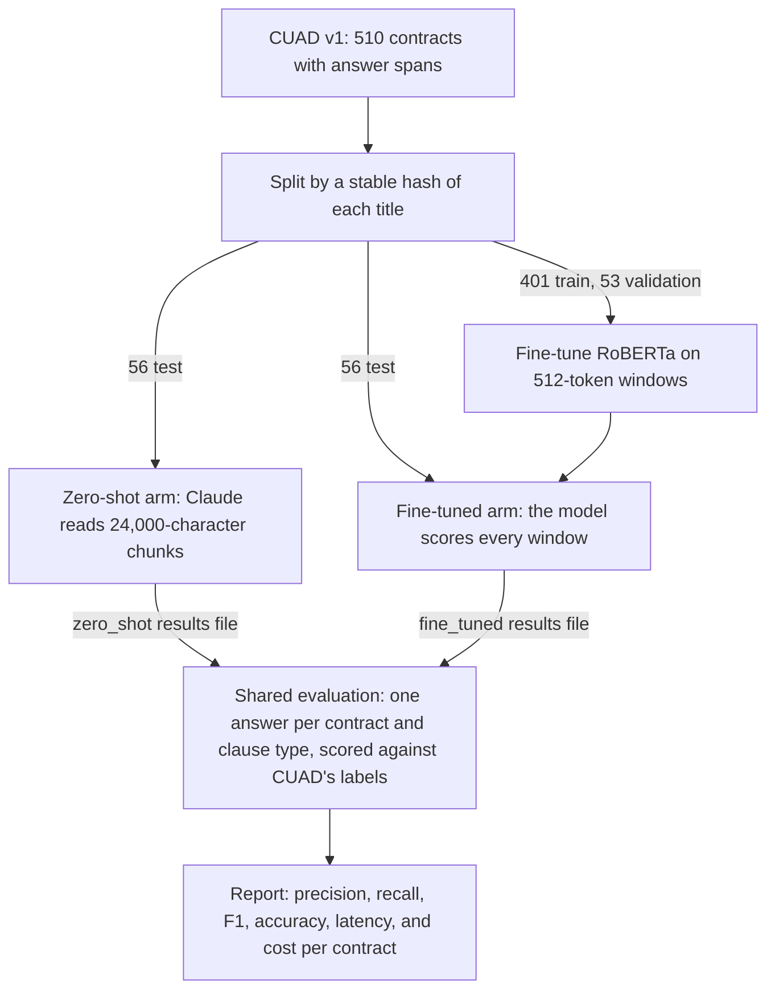

<div align="center">

# Contract Clause Classifier

### A zero-shot LLM against a fine-tuned transformer on contract clauses, compared on accuracy, cost, and latency

   [](https://github.com/Danielkgr/contract-clause-classifier/actions/workflows/ci.yml) 

</div>

<br>

> Prompting a general model and fine-tuning a small one are both reasonable ways to find a clause in a contract.  The choice turns on cost, latency, and where the contract text is allowed to go, as much as on accuracy.  This harness runs both approaches over the same [CUAD](https://huggingface.co/datasets/theatticusproject/cuad) contracts and reports precision, recall, F1, accuracy, cost per document, and latency for each clause type.

<br>

## What it is

An evaluation harness.  It fine-tunes a RoBERTa classifier, prompts an LLM zero-shot, and asks both the same question of every test contract, whether each clause type appears anywhere in it.  Both are scored against CUAD's labels, and a report compares accuracy, latency, and cost.  The report is framed as a build-or-buy decision for a team choosing between the two.

> [!IMPORTANT]
> It is not a deployed classifier.  It does not serve predictions, store contracts, or ship a production model.

It is a working prototype.  Its tests run every stage on stand-in models and a mocked API, which checks the plumbing and says nothing about accuracy.  Both arms have been run once on the CUAD test split, the zero-shot arm against the live API and the fine-tuned arm on a local GPU.

<br>

## Results

Both arms have been measured once, on the same 56 CUAD test contracts and 12 clause types.  The zero-shot arm ran on 6 October 2026 with `claude-opus-5-5` through the Anthropic API.  The fine-tuned arm trained `roberta-base` on 7 October 2026 on a local AMD Radeon RX 7900 XTX, and scored the test contracts on the same card.

| Measure, macro average over 12 clause types | Fine-tuned `roberta-base` | Zero-shot `claude-opus-5-5` |
|---|:--:|:--:|
| Precision | 0.768 | 0.757 |
| Recall | 0.788 | **0.934** |
| F1 | 0.736 | **0.818** |
| Accuracy | 0.875 | 0.891 |
| Labelled clauses found | 206 of 237 | 223 of 237 |
| False positives | 53 | 59 |
| Average latency per contract | **0.58 seconds** of local GPU time | 7.1 seconds over the API |
| Cost per contract | No per-call fee.  Training took 35 minutes on the same GPU. | $0.060 at list prices |
| Where the contract text goes | Nowhere.  It stays on the machine. | To the model provider |

| Clause type | Fine-tuned F1 | Zero-shot F1 | Better |
|---|:--:|:--:|---|
| Governing Law | 1.000 | 1.000 | Tie |
| Anti-Assignment | 0.919 | 0.959 | Zero-shot |
| Cap On Liability | **0.880** | 0.762 | Fine-tuned |
| Uncapped Liability | **0.636** | 0.563 | Fine-tuned |
| Audit Rights | 0.789 | **0.895** | Zero-shot |
| Termination For Convenience | 0.630 | **0.833** | Zero-shot |
| Change Of Control | 0.200 | **0.581** | Zero-shot |
| Exclusivity | 0.684 | **0.757** | Zero-shot |
| Non-Compete | 0.588 | **0.833** | Zero-shot |
| Insurance | 0.973 | 0.974 | Tie |
| License Grant | **0.962** | 0.926 | Fine-tuned |
| Warranty Duration | 0.571 | **0.727** | Zero-shot |

The zero-shot model finds more of the clauses that are there.  It missed 14 labelled clauses to the fine-tuned model's 31, and it scores higher F1 on seven of the twelve types.  The fine-tuned model's worst type is Change Of Control, where it found 1 of 9, and it also missed half the non-competes.  It does better on both liability types, where the zero-shot model either missed caps (8 of 24) or over-reported uncapped liability (14 false positives).  The two arms make about the same number of false positives overall, but in different places.  Nobody has yet read the disputed contracts to say whether a model or the label is right, and some of the gap may be how narrowly CUAD defines each type.

> [!IMPORTANT]
> Each arm is one run at its default settings, with one seed for the fine-tune and one prompt for the zero-shot model.  Neither was tuned on these contracts, and no interval is reported.  With 56 contracts, one contract moves a rare type's precision or recall by several points, so the per-type differences are indicative, not settled.  The fine-tuned model's latency is the time to tokenise and score each contract's windows on one consumer GPU, with the model already loaded.  The zero-shot cost is computed from each response's usage at list prices in `utils/pricing.py`, and the invoice is the authority.

On this run the trade-off is the one the harness was built to expose.  The zero-shot model is more accurate here, needs no training, and costs about six cents a contract.  The fine-tuned model is about twelve times faster, has no per-call fee, and keeps every contract in-house, at the price of a training run and weaker recall on the rarer types.

The artefacts sit in `outputs/`.  `zero_shot-claude-opus-5-5-multi.json` and `fine_tuned-roberta-base.json` hold every contract's labels, predictions, latency, and, for the zero-shot arm, cost and token counts.  `comparison_report.md`, `summary.md`, `comparison_metrics.csv`, and `comparison_plot.png` were written from those two files by `compare_classifiers.py compare`.  [outputs/PROVENANCE.md](outputs/PROVENANCE.md) records how each run was made, and the console output of both is in `eval-logs/`.  The trained model is not committed.

<br>

## Running the comparison

These are the four steps to make a run, in order and cheapest first.

### Estimate the cost, with no API key

```bash
python compare_classifiers.py estimate
```

This was its output for the CUAD test split on 6 October 2026.  Calls and characters are counted exactly from the run's own chunking.  The token and cost figures are estimates.

| Input | Value |
|---|---:|
| Contracts | 56 |
| Characters | 2,370,988 |
| Chunks of up to 24,000 characters, overlapping by 1,000 | 130 |
| Clause types | 12 |

| Prompt mode | Calls | Input tokens | Output tokens |
|---|---:|---:|---:|
| Multi-label | 130 | 0.66M | 0.03M |
| Single-label | up to 1,560 | up to 7.59M | up to 0.31M |

| Model | Multi-label | Single-label |
|---|---:|---:|
| `claude-opus-5-5` | $3.15 | up to $36.62 |
| `claude-sonnet-5-5` | $1.57 | up to $18.31 |
| `claude-haiku-4-5` | $0.79 | up to $9.15 |

> [!IMPORTANT]
> These are estimates at list prices, not measurements.  Tokens are characters divided by 4, each call is assumed to return 200 output tokens including thinking, and no prompt-cache or Batches API discount is applied.  Single-label figures are upper bounds, because a run stops asking about a clause type once one chunk of the contract has it.  A real run records the actual usage and cost of every call.

Asking about every clause type in one call means the model reads each part of a contract once, rather than once for each clause type.  With the 12 default clause types, that cuts the number of calls, and most of the cost, by roughly twelve times.  For a firm, it is the difference between paying for one read of each contract and paying for twelve.

### Run the zero-shot arm on Claude

Put an Anthropic API key in `.env` as `LLM_API_KEY`, or export `ANTHROPIC_API_KEY`, then:

```bash
python compare_classifiers.py zero-shot --max-contracts 5   # a first check on five contracts
python compare_classifiers.py zero-shot                     # all 56 test contracts
```

The second command reads the first five contracts' answers from the cache and asks only about the rest.  It writes `outputs/zero_shot-claude-opus-5-5-multi.json`.  Adding `--model claude-sonnet-5-5`, `--model claude-haiku-4-5`, or `--mode single` compares models or prompt modes, and each run writes its own file.

### Run the fine-tuned arm on a GPU

Fine-tuning RoBERTa needs a GPU in practice, for example a Google Colab notebook with a T4 GPU runtime:

```bash
!git clone https://github.com/Danielkgr/contract-clause-classifier.git
%cd contract-clause-classifier
!pip install -r requirements.txt
!python compare_classifiers.py fine-tune
```

It trains on the 401 training contracts, checks progress against the 53 validation contracts, scores the 56 test contracts, and writes `outputs/fine_tuned-roberta-base.json`.  In Colab, `from google.colab import files; files.download("outputs/fine_tuned-roberta-base.json")` downloads that file.  Put it in `outputs/` next to the zero-shot results.

The published run used a local AMD Radeon RX 7900 XTX instead, with PyTorch 2.14.1 built for ROCm 7.14, and trained in 35 minutes.  Any GPU that PyTorch supports will do.

### Write the report

```bash
python compare_classifiers.py compare
```

It scores every saved arm on the contracts they share and writes `comparison_report.md`, `summary.md`, `comparison_metrics.csv`, and `comparison_plot.png` to `outputs/`.  Those are the files the Results section cites.

<br>

## How it works

CUAD contracts are long.  The median runs to 33,000 characters and the longest to 338,000, and the clauses sit throughout.  Across the 510 contracts there are 2,510 cases of a contract containing one of the 12 default clause types, and in only 5 of them does the clause begin within the first 512 characters.  Both arms therefore read the whole contract.

Both arms answer the same question about the same 56 test contracts, and one shared evaluation scores them.



### Pipeline

| Stage | Code | What happens |
|---|---|---|
| **Load** | `load_cuad_dataset()` | Reads CUAD v1 (`CUAD_v1.json`) from `data/`, or downloads it from [Hugging Face](https://huggingface.co/datasets/theatticusproject/cuad).  CUAD has no splits, so each contract goes to train, validation, or test (401, 53, and 56 contracts) by a stable hash of its title.  `CUAD_PATH` or `--cuad` points it at another copy.  If no copy is found and the download fails, it stops with an error that says where to put the file. |
| **Wrap** | `ContractData` | Holds each contract's title, its full text, whether each clause type is present, and the character offsets of every CUAD answer span. |
| **Fine-tune** | `utils/classifier.py` | Trains one multi-label `roberta-base` model on overlapping windows of the training contracts, labelled from the answer spans. |
| **Zero-shot** | `utils/anthropic_client.py` | Asks Claude which clause types appear in each chunk of the contract, through the official `anthropic` SDK, with a JSON answer.  `utils/openai_client.py` keeps an OpenAI path for comparison. |
| **Evaluate** | `utils/evaluation.py` | Runs both arms over the test contracts, times each contract, and saves each arm's results. |
| **Report** | `utils/report.py` | Scores every saved arm on the contracts they share, and writes the metrics table, the plot, a summary, and the full report to `outputs/`. |

### The fine-tuned arm

| Aspect | Detail |
|---|---|
| **Model** | One `AutoModelForSequenceClassification` with a sigmoid output for each clause type, so it scores all of them in one pass |
| **Windows** | Each contract is tokenised whole and cut into 512-token windows that overlap by 128 tokens, so every part of it is read |
| **Labels** | A window is positive for a clause type when it overlaps one of that type's CUAD answer spans |
| **Sampling** | Every window with a clause is kept, plus an equal number of windows without one, drawn at random with a fixed seed |
| **Validation** | Windows from the 53 validation contracts, so no contract appears in both training and validation |
| **Prediction** | A contract contains a clause type when any of its windows scores 0.5 or more |

### The zero-shot arm

The client sends the contract in chunks of 24,000 characters that overlap by 1,000.  Claude is the default, called through the official `anthropic` SDK, with `claude-opus-5-5` as the default model.  The system prompt defines each clause type and asks for a JSON answer that lists the types appearing in the chunk, and Claude's structured outputs hold the answer to that format.

| Prompt mode | Calls | When a clause counts as present |
|---|---|---|
| **Multi-label**, the default | One call per chunk, about every clause type | When any chunk's answer lists it |
| **Single-label** | One call per chunk and clause type | When any chunk's answer lists it.  Once one chunk has a type, the remaining chunks are skipped for that type. |

Both modes share one prompt template, so they differ only in how many clause types each call covers.  In multi-label mode a contract needs roughly one call per chunk, where single-label mode needs up to one per chunk for every clause type.

A failed call is never read as absent.  If no chunk's answer lists a clause type and a call that could have found it failed, that contract and clause type are left out of the metrics and counted.  A call fails when the API returns an error, the model refuses, the answer is cut off at `LLM_MAX_TOKENS`, or the answer is not the JSON asked for.  A rejected API key or an unknown model stops the run at the first call instead.

> [!NOTE]
> The harness does not turn on Anthropic's server-side fallbacks.  A fallback would let a different model answer a refused request without that showing in the results, so a refusal is recorded as its own outcome instead.

The definitions come first in each request and are marked for prompt caching.  The API caches them only once they reach the model's minimum cacheable length, which is 512 tokens for Opus 5.5 and Sonnet 5.5 and 4,096 for Haiku 4.5.  With the 12 default clause types the system prompt is about 1,400 characters, roughly 350 tokens, which suggested there would be no cache reads at the defaults.  The live run says otherwise.  Its 130 calls recorded 99,792 cache read tokens and 3,168 cache write tokens, so the prefix the API counts is longer than the system prompt alone.  Each call records the cache reads that the API reports in its usage.

| Safeguard | What it does |
|---|---|
| **Retries** | A rate limit, an overloaded or failing server, or a dropped connection is retried up to five times, with a doubling, jittered wait that honours the server's `retry-after`.  The SDKs' own retries are off, so measured latency covers one attempt and never a wait. |
| **Response cache** | Every completed response is saved in `.cache/llm/`, keyed by provider, model, prompt version and text, clause types, request settings, and a hash of the chunk.  A run that stops at call 1,400 loses nothing, and a re-run with the same settings makes no API call.  Errors are not cached, so a re-run retries them. |
| **Concurrency** | Four contracts are asked about at a time by default, one call at a time within each, and results come back in contract order. |

### Latency and cost

Both arms are timed per contract.  For the LLM, that is the sum of its calls, and a call answered from the cache keeps the latency and cost measured when it was made.  Cost comes from the token usage each response reports, at the per-million prices in `utils/pricing.py`.  Cached input is priced at its own rate, and a model with no listed price is reported as not priced rather than charged at a guessed rate.  The OpenAI prices there were recorded on 2026-09-23 and need checking before use.  For the fine-tuned model, it is the time to tokenise and score every window.  The fine-tuned arm has no per-call fee, so its cost is reported as not priced unless `FT_COST_PER_HOUR` is set, in which case the measured time is multiplied by that rate.

### Choosing between the two

These are the trade-offs the report is built to test.  The run in [Results](#results) bears out the setup, running cost, latency, and data handling rows.  It also found something the table does not say, that on these contracts the zero-shot model was the more accurate, so the fine-tuned model's case rests on speed, cost at volume, and keeping the text in-house.  The volume and best fit rows are judgements the run cannot test.

| Consideration | Zero-shot LLM | Fine-tuned model |
|---|---|---|
| **Volume** | A few documents a day | Hundreds of documents a day |
| **Setup** | No training and no ML infrastructure | A training run and a GPU |
| **Running cost** | Per-token API fees on every call | A one-off training cost, then no per-call fee |
| **Latency** | An API round trip for every chunk | Local inference over every window of the contract |
| **Data handling** | Contract text goes to the provider | Contract text stays in-house |
| **Best fit** | A prototype or proof of concept | A long-term deployed service |

<br>

## Quick start

```bash
pip install -r requirements.txt
cp .env.example .env       # then put your Anthropic API key in it
python compare_classifiers.py estimate
python compare_classifiers.py zero-shot --max-contracts 5
```

The first command that reads CUAD downloads `CUAD_v1.json` (about 40 MB) from Hugging Face.  To work offline, save that file to `data/CUAD_v1.json`, or point `CUAD_PATH` or `--cuad` at it.  `estimate` needs no API key.  `zero-shot --max-contracts 5` asks Claude about five test contracts, which is the cheapest way to see the pipeline work.

Settings come from `.env` and the environment.  The file is read once at startup, a variable already set in the shell takes precedence over it, and command-line flags override both.

```bash
pip install -r requirements-dev.txt
ruff check . && ruff format --check .
pytest
```

The tests cover CUAD parsing, splitting, and answer spans, chunking and window labelling, both evaluation arms and both prompt modes with stand-in models, the Claude and OpenAI clients with the API mocked at the HTTP layer, prices and cost, the handling of failed calls and refusals, retries, the response cache, concurrency, the cost estimate, loading settings from `.env`, and masking the API key.  They make no network calls, need no API key, and need only `requirements-dev.txt`, which has no torch.  One of them checks the real CUAD file when `data/CUAD_v1.json` is present.  One more test trains, saves, reloads, and runs the real classifier with a tiny model.  It needs torch and transformers, downloads the model, and runs only with `RUN_SMOKE=1 pytest`.  CI runs the lint, format, and test commands above on Python 3.12 and 3.13 for every push and pull request.

<br>

## Usage

### Commands

| Command | What it does | Needs |
|---|---|---|
| `estimate` | Counts the calls and characters a zero-shot run would send and prices them, with no API call | CUAD, or a contract text file |
| `zero-shot` | Asks the LLM about every test contract and saves `outputs/zero_shot-<model>-<mode>.json` | An API key |
| `fine-tune` | Trains RoBERTa on the train split, checked against the validation split, then scores the test split and saves `outputs/fine_tuned-<model>.json` | torch, and in practice a GPU |
| `compare` | Writes the report from every saved arm result in `outputs/` | Saved arm results |
| `show-config` | Shows the active settings, with the API key masked | Nothing |

Each arm saves its own results, so the zero-shot arm can run on a laptop and the fine-tuned arm on a GPU machine, and `compare` reports on whatever it finds.  It scores every arm on the contracts and clause types they all share.  Every command takes `--clause-types`, `--output DIR`, and `--cuad PATH`, and `python compare_classifiers.py <command> --help` lists the rest.

```bash
# Five test contracts, the cheapest real run
python compare_classifiers.py zero-shot --max-contracts 5

# Claude Haiku 4.5, asking about one clause type per call
python compare_classifiers.py zero-shot --model claude-haiku-4-5 --mode single

# Score the saved model again without training, or train without scoring
python compare_classifiers.py fine-tune --skip-training
python compare_classifiers.py fine-tune --skip-evaluation --epochs 1

# Ask again without the response cache
python compare_classifiers.py zero-shot --no-cache

# Estimate the cost for a contract of your own
python compare_classifiers.py estimate --text-file contract.txt
```

The estimate counts calls and characters exactly from the run's own chunking.  Tokens are characters divided by 4 and output is assumed at 200 tokens per call, which `--output-tokens` changes, so its token and cost figures are estimates.

<br>

## Reference

### Environment variables

| Variable | Default | Purpose |
|---|---|---|
| `LLM_PROVIDER` | `anthropic` | `anthropic` for Claude, or `openai` for the comparison path |
| `LLM_MODEL` | `claude-opus-5-5` | `claude-opus-5-5`, `claude-sonnet-5-5`, or `claude-haiku-4-5`.  The `openai` provider defaults to `gpt-4o-mini`. |
| `LLM_API_KEY` | Unset | API key for the chosen provider.  When it is unset, the key comes from `ANTHROPIC_API_KEY` or `OPENAI_API_KEY`, and `zero-shot` needs one of them. |
| `LLM_MODE` | `multi` | `multi` asks about every clause type in one call per chunk.  `single` asks about one clause type per call. |
| `LLM_EFFORT` | `low` | Thinking depth for Opus and Sonnet: `low`, `medium`, `high`, `xhigh`, or `max`.  Haiku takes no effort setting. |
| `LLM_MAX_TOKENS` | `2048` | Cap on output tokens, thinking included.  Output is billed as used, not at the cap. |
| `LLM_TEMPERATURE` | Unset | Sent only when set.  `claude-opus-5-5` and `claude-sonnet-5-5` reject it. |
| `LLM_TIMEOUT` | `120` | Seconds to wait for one response |
| `LLM_MAX_ATTEMPTS` | `6` | Tries per call when the API fails in a way that may pass on a retry |
| `LLM_CONCURRENCY` | `4` | Contracts asked about at the same time |
| `LLM_CACHE_DIR` | `.cache/llm` | Where completed responses are kept |
| `LLM_BASE_URL` | Optional | An OpenAI-compatible server, for Azure or Ollama for example.  `openai` provider only. |
| `LLM_CHUNK_CHARS` | `24000` | Characters of contract per LLM call |
| `LLM_CHUNK_OVERLAP` | `1000` | Characters shared by consecutive chunks |
| `CUAD_PATH` | Unset | A `CUAD_v1.json` to read instead of `data/CUAD_v1.json` or a download |
| `TRAIN_MODEL` | `roberta-base` | Hugging Face model to fine-tune |
| `BATCH_SIZE` | `8` | Training and inference batch size |
| `LR` | `2e-5` | Learning rate |
| `NUM_EPOCHS` | `3` | Training epochs |
| `MAX_LENGTH` | `512` | Window length in tokens, capped at what the model accepts |
| `WEIGHT_DECAY` | `0.01` | AdamW weight decay |
| `WARMUP_STEPS` | `500` | Learning-rate warmup steps |
| `EVAL_STEPS` | `500` | Evaluation frequency during training |
| `SAVE_STEPS` | `1000` | Checkpoint frequency |
| `WINDOW_STRIDE` | `128` | Tokens shared by consecutive windows |
| `NEGATIVE_WINDOW_RATIO` | `1.0` | Windows without a clause kept for each window with one |
| `FT_THRESHOLD` | `0.5` | Score at which a window counts as containing a clause |
| `FT_COST_PER_HOUR` | Unset | USD per hour for the inference machine.  Unset leaves the fine-tuned arm unpriced. |

### Default clause types

The defaults are 12 of CUAD's 41 categories, a mix of common and rarer clauses.  Any other category can be chosen with `--clause-types`, spelled as it is in `CUAD_CATEGORIES` in `config.py` though case does not matter.  A name that is not a CUAD category stops the command with an error that lists the valid ones, rather than labelling every contract as absent.

| Clause type | What it covers |
|---|---|
| **Governing Law** | Which state or country's law governs the contract |
| **Anti-Assignment** | Consent or notice needed before the contract can be assigned |
| **Cap On Liability** | A cap on a party's liability for breach |
| **Uncapped Liability** | Liability left uncapped, for all breaches or a particular kind |
| **Audit Rights** | A right to audit the other party's books, records, or premises |
| **Termination For Convenience** | A right to terminate without cause |
| **Change Of Control** | Rights triggered by a change of control, merger, or asset sale |
| **Exclusivity** | An exclusive dealing commitment with the other party |
| **Non-Compete** | A restriction on competing with the other party |
| **Insurance** | A requirement to maintain insurance |
| **License Grant** | A licence granted by one party to the other |
| **Warranty Duration** | How long a warranty lasts |

### Output artefacts

Every artefact is written to `outputs/`.

| File | Contents |
|---|---|
| `zero_shot-<model>-<mode>.json` | One zero-shot run: every contract's labels, predictions, latency, cost, and calls, and the settings used |
| `fine_tuned-<model>.json` | The same for the fine-tuned model |
| `comparison_metrics.csv` | Metrics for each clause type and each method, in long format |
| `comparison_plot.png` | A two-by-two bar chart of precision, recall, F1, and accuracy |
| `summary.md` | A short summary with the key numbers |
| `comparison_report.md` | The full report, with measured latency and cost, per-clause results with confusion counts, and the settings used |

### Metrics module

| Class or function | Purpose |
|---|---|
| `ClassificationMetrics` | Precision, recall, F1, accuracy, and the TP, FP, TN, and FN counts |
| `InferenceStats` | Total, average, minimum, and maximum latency per contract in milliseconds, cost or none when unpriced, and token counts |
| `aggregate_metrics()` | Mean of each metric across clause types, with the lowest and highest precision |

### Stack

| Area | Libraries |
|---|---|
| **CLI** | `argparse`, from the standard library |
| **Machine learning** | `torch`, `transformers`, `accelerate` |
| **Data** | `huggingface_hub`, `pandas` |
| **Evaluation** | `scikit-learn`, `numpy` |
| **LLM APIs** | `anthropic` for Claude, `openai` for the comparison path |
| **Charts** | `matplotlib` |
| **Utilities** | `python-dotenv` |
| **Tests and lint** | `pytest`, `ruff` |

<br>

## Layout

```text
contract-clause-classifier/
  compare_classifiers.py     Command line: estimate, zero-shot, fine-tune, compare, show-config
  config.py                  Configuration as dataclasses, read from the environment
  requirements.txt           Python dependencies
  requirements-dev.txt       Test and lint dependencies, without torch
  pyproject.toml             Ruff and pytest settings
  .github/workflows/ci.yml   Lint, format check, and tests on every push and pull request
  .env.example               Environment variable template (optional)
  utils/
    __init__.py              Public API exports
    llm_client.py            Provider-neutral zero-shot client and the provider switch
    anthropic_client.py      Claude through the official anthropic SDK
    openai_client.py         OpenAI, kept for comparison
    prompts.py               The shared prompt, its JSON answer, and the clause definitions
    pricing.py               List prices and the cost of a call from its usage
    response_cache.py        Completed API responses on disk, so a re-run is free
    estimate.py              Calls, tokens, and cost of a run, estimated with no API call
    report.py                The comparison report, from saved arm results
    data_loader.py           CUAD loading and splitting, from data/ or Hugging Face
    classifier.py            Windowed multi-label transformer (FineTunedClassifier)
    chunking.py              Contract chunks and window labels from answer spans
    evaluation.py            Contract-level evaluation of both arms, and their saved results
    metrics.py               ClassificationMetrics, InferenceStats, aggregation helpers
  tests/                     Loader, chunking, evaluation, prompt, cost, and client tests, plus a smoke test
  data/                      Optional local copy of CUAD_v1.json
  models/                    Saved fine-tuned checkpoints
  outputs/                   Results, created on the first run
  .cache/llm/                Cached LLM responses, created by the first zero-shot run
```

<br>

## Licence

MIT.  See [LICENSE](LICENSE).
